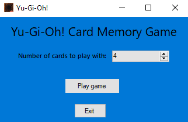
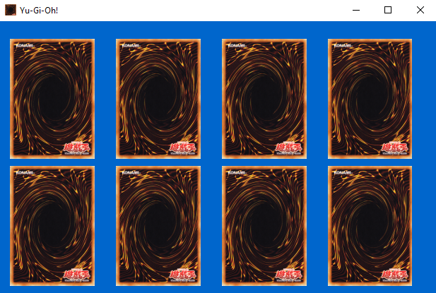
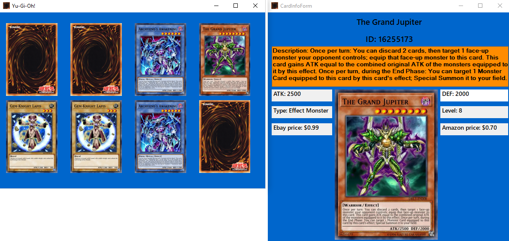
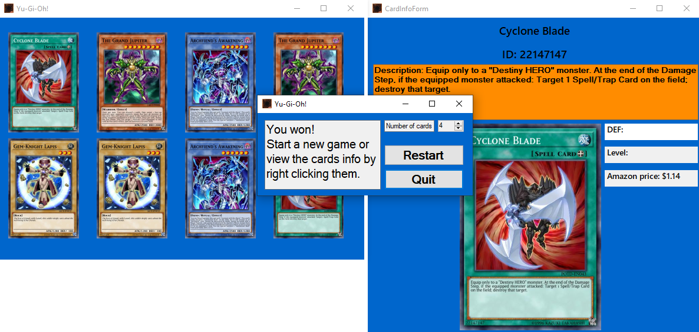

# <div align="center"> Yu-Gi-Oh! - Card memory game <br> Windows Forms w/ C#</div>

## За играта
__*Yu-Gi-Oh! - Card memory game*__ е едноставна логичка игра во која целта е да се пронајдат сите парови на карти. Под пар на карти се подразбира 2 карти кои што имаат иста слика. Играчот има можност да избере со каква тежина ќе биде играта, односно може да избере од 4 до 24 карти кои ќе треба да ги пронајде како парови. 
<br>
<br>
При **скоро** секое стартување на играта, играме со различни карти позиционирани на различни места. Ова го постигнуваме со помош на онлајн база на податоци во која има над 11,000 **Yu-Gi-Oh!** карти. За оваа база има [API](https://db.ygoprodeck.com/api-guide/) со кој имаме можност да пребаруваме и преземаме информации за картите кои се дадени во JSON формат.

## Имплементација на играта 
На почотекот, кога ќе ја вклучиме играта ни се појавува првата форма:<br>

<br>
Имаме 2 копчиња:
* Play game - со притискање, ни се закрива моменталната форма и се отвора главната форма во која ќе се прикажуваат картите
* Exit - се повикува `Application.Exit();`

<br>

При кликање на копчето **Play game** ни се отвара следната форма:
<br>



Во зависност од тоа колку карти сме избрале на претходната форма, толку **PictureBox** контроли ќе ни се генерираат и постават во __Panel__ контрола за полесно да управуваме со нив. **PictureBox** контролите се поставуваат динамички на формата, односно според бројот на карти соодветно се зголемува големината на формата и се прави простор за поставување на сите карти. Сета оваа логика може да се виде во методот `CreatePictureBoxes()`. 
<br>
По креирање на контролите за слики, нивните слики ги иницијализираме на default сликата за карта со методот:
```cs
private void InitPictureBoxImages()
{
    foreach (PictureBox pictureBox in panelCards.Controls)
    {
        pictureBox.Image = Properties.Resources.Back_AE;
    }
}
```
Следно, ќе направиме преземање на картите од онлајн базата:
```cs
private void FillPictures()
{
    panelCards.Height = ClientRectangle.Height - 50;
    panelCards.Width = ClientRectangle.Width - 50;

    while (_pictureBoxIds.Count != 0)
    {
        var card = GetRandomCard();

        // Ensure we get a valid card
        if (card == null)
        {
            while (true)
            {
                card = GetRandomCard();
                if (card == null) continue;
                break;
            }
        }

        // Add card id to the hashset
        _cards.Add(card.id);

        // Process a pair of picture boxes
        ProcessPictureBox(card);
        ProcessPictureBox(card);
    }
}
```
Со while(true) циклусот, се осигураме дека навистина ќе добиеме валидна карта затоа што може да се случи да добиеме невалиден одговор од базата.
Наредно ќе го разгледаме методот што прави повик до API-то:
```cs
private static Card GetRandomCard()
{
    WebRequest request = WebRequest.Create("https://db.ygoprodeck.com/api/v7/randomcard.php");

    WebResponse response = request.GetResponse();

    Stream dataStream = response.GetResponseStream();

    StreamReader streamReader = new StreamReader(dataStream ?? throw new InvalidOperationException());

    dynamic cardJson = JsonConvert.DeserializeObject(streamReader.ReadToEnd());

    response.Close();

    return cardJson == null ? null : (Card) JsonConvert.DeserializeObject<Card>(cardJson.ToString());
}
```
Чекори на преземањето карта:
- праќаме барање до **API**-то
- го преземаме одговорот во response објектот
- правиме **Stream** за да го прочитаме одговорот со **StreamReader**
- бидејќи знаеме дека како одговор ќе добиеме **JSON string**, го десеријализираме добиениот одговор во **JSON** формат
- ја затвораме **Socket** конекцијата до серверот
- враќаме десеријализирана карта како објект **Card**
  
За серијализација/десерејализација ја употребив [Json.NET](https://www.newtonsoft.com/) рамката.

Во кодот подолу ни е дадено додавањето на разните **Click** настани на претходно направените **PictureBox** контроли:
```cs
private void ProcessPictureBox(Card card)
{
    // Get a random picture box from the panel and give it a card 
    var rnd = new Random();
    var pictureBox =
        (PictureBox) panelCards.Controls.Find(_pictureBoxIds.ElementAt(rnd.Next(0, _pictureBoxIds.Count)),
            false)[0];

    _pictureBoxIds.Remove(pictureBox.Name);

    if (card.pictureBoxes == null)
    {
        card.pictureBoxes = new List<string>();
    }

    card.pictureBoxes.Add(pictureBox.Name);

    pictureBox.MouseClick += (sender, mouseEventArgs) =>
    {
        PictureClick(sender, mouseEventArgs, card, pictureBox);
    };

    pictureBox.MouseEnter += (sender, e) =>
    {
        pictureBox.Width -= 5;
        pictureBox.Height -= 5;
    };

    pictureBox.MouseLeave += (sender, e) =>
    {
        pictureBox.Width += 5;
        pictureBox.Height += 5;
    };
}
```
Кога претходно ги правевме **PictureBox** контролите, нив ги додадовме во **Panel** контрола. Сега од оваа панела ќе земеме листа од сите **PictureBox** контроли во неа и ќе вратиме случајна контрола на која ќе и ги додадеме потребните настани.<br>
Со додавање на настаните **MouseEnter** и **MouseLeave**, на некој начин на **PictureBox** контролите им додаваме **"hover"** ефект.<br>
На настанот **MouseClick** му додаваме еден **custom** настан во кој ќе се справуваме со лев и десен клик на контролата:
```cs
private void PictureClick(object sender, MouseEventArgs e, Card card, PictureBox pictureBox)
{
    if (((e.Button & MouseButtons.Left) != 0) && _cards.Count != 0)
    {
        if (_firstCard.clicked && _secondCard.clicked)
            return;

        // Open a new form display the card information
        CardInformation(card);

        pictureBox.LoadAsync(card.card_images[0].image_url);

        // First card is not clicked at the start or when we get a card match
        if (!_firstCard.clicked)
        {
            pictureBox.Enabled = false;

            _firstCard = card;
            _firstCard.clicked = true;
            return;
        }

        // With the previous check if statement, we are sure that this will be the second card
        _secondCard = card;
        _secondCard.clicked = true;

        if (_firstCard.id == _secondCard.id)
        {
            // Remove card from the hashset
            _cards.Remove(_firstCard.id);

            if (_cards.Count == 0)
            {
                _endForm?.Close();
                _endForm = new EndForm(MainFormRef, _cardInfoForm);
                _endForm.Show();

                // Enable all picture boxes so we can still preview them
                foreach (PictureBox pb in panelCards.Controls)
                {
                    pb.Enabled = true;
                }

                return;
            }

            // Disable both picture boxes associated with the image
            foreach (var pb in _firstCard.pictureBoxes)
            {
                panelCards.Controls.Find(pb, true)[0].Enabled = false;
            }

            _firstCard = new Card();
            _secondCard = new Card();
            return;
        }

        timerCheckCards.Start();
    }
    // We finished the game, but you can still preview the cards info with right clicking them
    else if ((e.Button & MouseButtons.Right) != 0 && _cards.Count == 0)
    {
        CardInformation(card);
    }
}
```
Во погорниот код, за настанот лев клик проверуваме дали имаме кликнато карта. Ако немаме кликнато, тоа значи дека само што сме ја започнале играта или пак сме погодиле пар на карти и немаме активни карти што се кликнати.<br>
Кога ќе биде кликната втора карта, ги споредуваме нивните id-а. Доколку се исти, значи сме погодиле пар:
- Ако тоа не е последниот пар што останал во играта, ги гасиме двете **PictureBox** контроли кои што биле за тие карти за да оневозможиме повторно кликање на истите;
- Ако пак тоа е последниот пар на точно погодени карти, ги активираме сите **PictureBox** контроли за да може да се справуваме со настанот MouseClick во кој што е притиснат десниот клик од глувчето.

При секој лев клик на карта, ни се отвара нова форма во која се прикажани дополнителни информации за картата. Тоа го правиме со методот:
```cs
private void CardInformation(Card card)
{
    // If it's the same card, but a different picture box do nothing
    if (CardInfoForm._card?.card_images[0].image_url == card.card_images[0].image_url)
        return;

    // If there's already a form showing a card info, close it
    _cardInfoForm?.Close();

    _cardInfoForm = new CardInfoForm(card);
    _cardInfoForm.Show();

    _cardInfoForm.StartPosition = FormStartPosition.Manual;
    _cardInfoForm.SetDesktopLocation(MainFormRef.Right - 10, MainFormRef.Location.Y);
}
```
Доколку картата што сме ја кликнале ја има веќе отворено во формата за приказ на карти, веднаш правиме **return** за да ја повторуваме истата постапка за креирање на формата и приказ на информациите.<br>
Во спротивно, ако има отворено форма, ја гасиме и отвораме нова форма со пратената карта во методот.<br><br>
Кога двете кликнати карти се различни, стартуваме еден тајмер кој извршува код на секои 500ms(кодот ќе се изврши само еднаш бидејќи веднаш го гасиме тајмерот). Кога ќе биде извршен кодот од тајмерот, бидејќи картите биле различни ги пронаоѓаме соодвените **PictureBox** контроли и им ги враќаме default-ните слики.
```cs
private void timerCheckCards_Tick(object sender, EventArgs e)
{
    timerCheckCards.Stop();

    foreach (var pb in _firstCard.pictureBoxes)
    {
        var pictureBox = (PictureBox) panelCards.Controls.Find(pb, false)[0];

        // If the pic has the back image already, it means the other pic box needs to be changed
        if (pictureBox.Image == Properties.Resources.Back_AE)
            continue;

        // If we got to this point, two cards have been opened and they were not the same one
        // Gotta enable the card which we disabled previously to prevent clicking the same card
        pictureBox.Enabled = true;
        pictureBox.Image = Properties.Resources.Back_AE;
    }

    foreach (var pb in _secondCard.pictureBoxes)
    {
        var pictureBox = (PictureBox) panelCards.Controls.Find(pb, false)[0];

        // If the pic has the back image already, it means the other pic box needs to be changed
        if (pictureBox.Image == Properties.Resources.Back_AE)
            continue;

        pictureBox.Image = Properties.Resources.Back_AE;
    }

    // Reset active cards
    _firstCard = new Card();
    _secondCard = new Card();
}

```
## Слики од изгледот на играта

### Слика од мени формата


### Слика од формата во која се ставени картите


### Слика од формата која ги прикажува информациите за картите и формата со картите


### Слика од формата која се прикажува кога ќе ја завршиме играта


